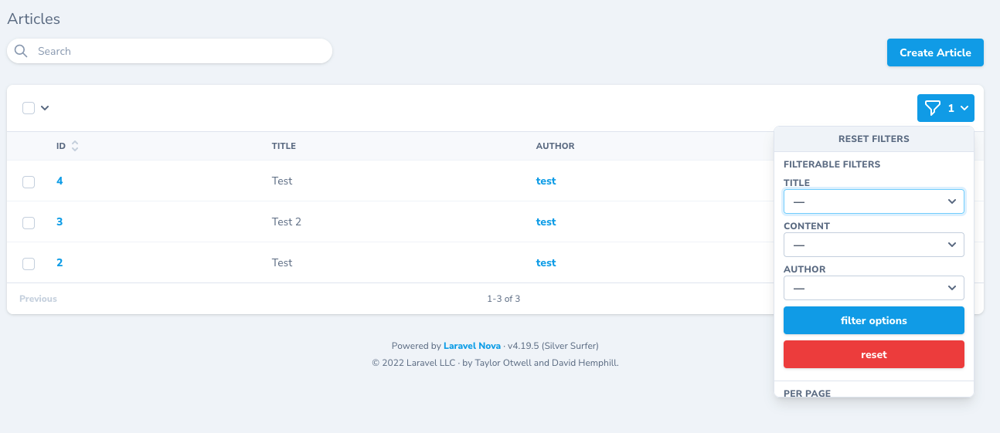

# filterable-filters

This package can create filters based on the columns in your database. It can also filter out unused options.

```
composer require tomodo531/filterable-filters
```



## Example:

### Model:
```
namespace App\Models;

use Illuminate\Database\Eloquent\Factories\HasFactory;
use Illuminate\Database\Eloquent\Model;

class Article extends Model
{
    use HasFactory;

    protected $fillable = [
        'title',
        'content',
    ];

    public function categories()
    {
        return $this->belongsToMany(Category::class, 'category_article');
    }

    public function author()
    {
        return $this->belongsTo(User::class, 'user_id');
    }
}

```
### Fields:

```
public function fields(NovaRequest $request)
    {
        return [
            ID::make()->sortable(),

            Text::make('Title')
                ->required(),

            Textarea::make('Content')
                ->required(),

            BelongsTo::make('Author', 'author', User::class),

            BelongsToMany::make('Categories'),
        ];
    }
```
### Filters:
```
    public function filters(NovaRequest $request)
    {
        return [
            FilterableFilters::make(\App\Models\Article::class)
                ->fields([
                    'title', // if the field is not relational then just write the name of the database column.
                    'content',
                    'author' => [
                        'title' => 'name', // Works like the title in a nova resource. This is the name of the column that will be shown in the selector.
                        'primarykey' => 'id', // The primary key of the relational tabel. In this example the primary key of the auther or user table is 'id'.
                        'foreignkey' => 'user_id' // The foreign key in the nova resource model.
                    ],
                ]),                
        ];
    }
```
